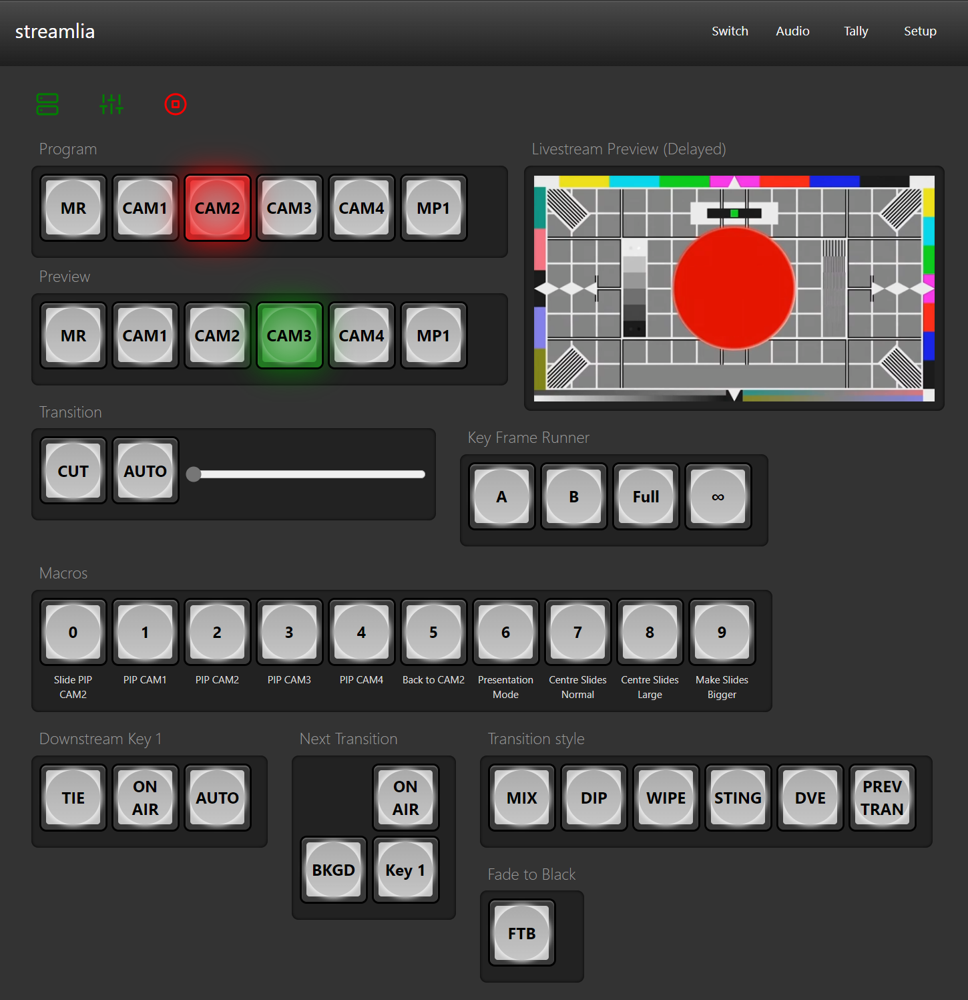

# ATEM Switcher

Making the ATEM Switcher [accessible and conventional](https://atem.streamlia.com).

This application lives along side the ATEM Software Control software (Windows only) and provides access to the most needed controls through a browser. [Brief demonstration](https://www.youtube.com/watch?v=8qGKA9M4bH4).

## Features

* Input Switching
* Tally Light
* Run Macros
* Run between Key Frames
* Upstream and Downstream Keys
* Livestream Preview

## Building

This project relies on a COM reference to the BMD interop DLL installed as part of the ATEM Software Control. Build the software using the .NET Framework version of MSBuild, which contains the [ResolveComReference build task](https://docs.microsoft.com/en-ca/visualstudio/msbuild/resolvecomreference-task).

Use the `build.ps1` script to build from the command line.

## Get Going

1. Download and install the [ATEM Switchers](https://www.blackmagicdesign.com/support/family/atem-live-production-switchers) software
1. Download the [latest release](https://github.com/tomblchr/atem-streamlia/releases) and extract the archive or build from source using the `build.ps1` PowerShell script
1. Run the `SwitcherServer.exe` console application
1. Open https://localhost (or the address directed by the startup log messages) in a browser
    * The browser may show a security warning saying "Your connection is not private". This is because of the self-signed SSL certificate. 
1. Connect the application to the ATEM
    1. The application will first attempt to connect to the ATEM via USB
    1. To connect the ATEM over a network use the Setup option to enter the IP address of the ATEM
1. (optional)
    1. Create a firewall rule to allow remote connections
        * In PowerShell... `New-NetFirewallRule -DisplayName "ATEM streamlia" -Direction Inbound -LocalPort 443 -Protocol TCP -Action Allow`
    2. Use a browser on a network connected to device to access the address https://[ipaddress|machine name]
        * Check the Setup tab for a URL

## Inspirations

Looking for an alternative to operate your ATEM? Try these projects...

* https://github.com/filiphanes/atem-live-controller
    * A similar concept implemented using Node.js. Uses the [applest-atem](https://github.com/applest/node-applest-atem) library to communicate with the ATEM.
* https://github.com/LibAtem/LibAtem
    * A .NET Core library not shackled to the ATEM SDK.
* https://github.com/bitfocus/companion
    * Highly customizable for many types of hardware.
* https://mixeffect.app/
    * Feature rich iOS App that connects directly to the ATEM.

## Contributing

1. Fork it ( https://github.com/tomblchr/atem-streamlia )
2. Create your feature branch (`git checkout -b my-new-feature`)
3. Implement your feature
4. Commit your changes (`git commit -am 'Add some feature'`)
5. Push to the branch (`git push origin my-new-feature`)
6. Create new Pull Request

## To Do

* Audio monitoring
* Keyboard shortcuts
* Streaming and recording controls
